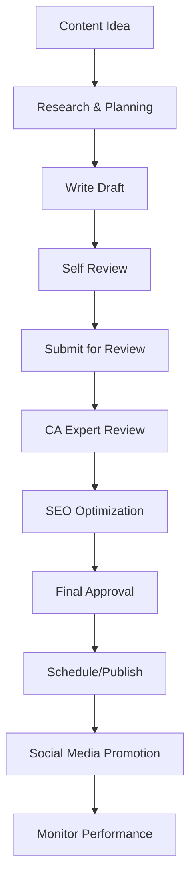
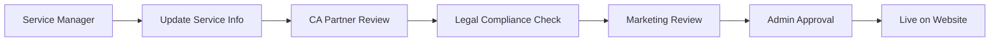

# Complete Content Management Flow - CA Professional Website

## 🎯 Overview
This is your complete, actionable guide for managing all content on the CA Professional Website. Follow these step-by-step procedures to update blogs, services, team information, and all other content.

## 📝 Blog Management - Step by Step

### How to Create a New Blog Post

#### Step 1: Access Admin Panel
1. Login to admin panel at `yourwebsite.com/admin`
2. Navigate to **Content** → **Blog Posts**
3. Click **"Add New Post"** button

#### Step 2: Fill Basic Information
```typescript
// Required Fields
Title: "Understanding GST Compliance in 2024"
Slug: "gst-compliance-2024" (auto-generated)
Category: Select from dropdown (Tax Updates, Business Tips, etc.)
Tags: Add relevant tags (GST, Compliance, 2024)
Author: Select from CA team members
```

#### Step 3: Write Content
```markdown
# Content Structure Template

## Introduction (100-150 words)
- Hook the reader with a compelling opening
- State the problem or topic clearly
- Preview what they'll learn

## Main Content (800-1500 words)
### Section 1: Key Point
- Use bullet points for clarity
- Include real examples
- Add actionable advice

### Section 2: Implementation
- Step-by-step instructions
- Include screenshots if helpful
- Provide templates or checklists

## Conclusion (100-150 words)
- Summarize key takeaways
- Include clear call-to-action
- Encourage reader engagement
```

#### Step 4: SEO Optimization
```bash
# SEO Checklist
□ SEO Title (50-60 characters): "GST Compliance Guide 2024 | Expert CA Advice"
□ Meta Description (150-160 characters): "Complete GST compliance guide for 2024. Expert tips from chartered accountants to avoid penalties and stay compliant."
□ Featured Image: Upload high-quality image (1200x630px)
□ Alt Text: Add descriptive alt text for images
□ Internal Links: Link to relevant services and other blog posts
□ External Links: Link to authoritative sources (open in new tab)
```

#### Step 5: Review and Publish
1. Click **"Save as Draft"**
2. Use **"Preview"** to check formatting
3. Submit for **"Review"** when ready
4. After approval, **"Schedule"** or **"Publish Immediately"**

### Blog Update Workflow


## 🛠️ Service Management - Step by Step

### How to Add a New Service

#### Step 1: Access Service Management
1. Login to admin panel
2. Navigate to **Services** → **Manage Services**
3. Click **"Add New Service"**

#### Step 2: Basic Service Information
```typescript
// Service Details Form
Service Name: "Tax Planning & Advisory"
Category: "Tax Planning" (dropdown)
Subcategory: "Individual Tax Planning"
Short Description: "Comprehensive tax planning for individuals and businesses"
Detailed Description: "Full detailed description with benefits, process, etc."
```

#### Step 3: Pricing Information
```typescript
// Pricing Structure
Pricing Type: "Range" (Fixed/Hourly/Range/Custom)
Minimum Price: ₹15,000
Maximum Price: ₹50,000
Currency: INR
Duration: "2-3 weeks"
Complexity: "Medium" (Simple/Medium/Complex/Expert)
```

#### Step 4: Requirements & Deliverables
```markdown
## Requirements (What client needs to provide)
- [ ] PAN Card copy
- [ ] Previous year's ITR
- [ ] Investment details
- [ ] Bank statements
- [ ] Salary slips (if applicable)

## Deliverables (What client will receive)
- [ ] Comprehensive tax planning report
- [ ] Investment recommendations
- [ ] Tax-saving strategies
- [ ] Implementation timeline
- [ ] Follow-up consultation
```

#### Step 5: SEO & Marketing
```bash
# SEO Fields
□ SEO Title: "Professional Tax Planning Services | Expert CA Advice"
□ SEO Description: "Get expert tax planning services from qualified CAs. Save taxes legally with our comprehensive planning strategies."
□ Featured Image: Upload service-related image
□ Gallery Images: Add multiple images showing process/team
□ Call-to-Action: "Get Free Consultation"
```

### Service Update Process


## 👥 Team Management - Step by Step

### How to Add New Team Member

#### Step 1: HR Creates Profile
1. Navigate to **Team** → **Team Members**
2. Click **"Add New Member"**
3. Fill basic information:

```typescript
// Personal Information
First Name: "Rajesh"
Last Name: "Kumar"
Designation: "Senior Chartered Accountant"
Department: "Tax Advisory"
Join Date: "2020-01-15"
Bio: "Brief professional bio highlighting expertise"
```

#### Step 2: Professional Details
```typescript
// Professional Information
Membership Number: "123456"
Membership Type: "Associate" or "Fellow"
Qualifications: ["B.Com", "CA", "CS"]
Specializations: ["Corporate Tax", "GST", "Audit"]
Experience Years: 8
Achievements: ["Best CA Award 2023", "Tax Expert Recognition"]
```

#### Step 3: Contact & Display Settings
```typescript
// Contact Information
Email: "rajesh@yourfirm.com"
Phone: "+91-9876543210"
LinkedIn: "https://linkedin.com/in/rajeshkumar"

// Display Settings
Is Active: true
Show on About Page: true
Display Order: 1 (for ordering on website)
Public Profile: true
```

### Team Profile Update Process
1. **Individual CA** logs into profile portal
2. Updates professional information
3. Uploads new profile photo
4. **HR** reviews changes
5. **Admin** approves and publishes

## 📚 Knowledge Hub Management

### How to Add Knowledge Resources

#### Step 1: Choose Resource Type
```typescript
// Resource Types Available
- Article: In-depth guides and tutorials
- Calculator: Interactive financial tools
- Template: Downloadable forms and documents
- Webinar: Recorded and live sessions
- Case Study: Real-world examples
- Update: Latest regulatory news
```

#### Step 2: Create Resource
1. Navigate to **Knowledge Hub** → **Resources**
2. Click **"Add New Resource"**
3. Select resource type
4. Fill information:

```typescript
// Resource Information
Title: "Income Tax Calculator 2024"
Type: "Calculator"
Category: "Tax Tools"
Description: "Calculate your income tax liability for FY 2023-24"
Content: "Detailed instructions or embed code"
Download URL: "Link to calculator or file"
Is Public: true
Featured: false
```

## 🔄 Daily Content Tasks

### Morning Routine (30 minutes)
```bash
# Daily Checklist - 9:00 AM
□ Check Google Analytics for yesterday's performance
□ Review and respond to new blog comments
□ Check contact form submissions
□ Monitor social media mentions
□ Review scheduled content for today
□ Check for broken links or errors
```

### Content Review (1 hour)
```bash
# Review Tasks - 10:00 AM
□ Review blog posts in "draft" status
□ Check service updates awaiting approval
□ Review team profile changes
□ Approve/reject knowledge hub submissions
□ Update content calendar
□ Respond to client inquiries
```

### Content Creation (2-3 hours)
```bash
# Creation Tasks - 2:00 PM
□ Write new blog post or continue draft
□ Update service descriptions if needed
□ Create social media content
□ Research trending topics in CA industry
□ Update FAQ section based on client queries
□ Optimize existing content for SEO
```

## 📅 Weekly Schedule

### Monday - Planning Day
```markdown
## Monday Tasks (2 hours)
- [ ] Review last week's analytics
- [ ] Plan this week's content
- [ ] Schedule social media posts
- [ ] Update content calendar
- [ ] Assign tasks to team
- [ ] Check competitor content
```

### Tuesday - Blog Day
```markdown
## Tuesday Tasks (3 hours)
- [ ] Publish scheduled blog post
- [ ] Write next blog post
- [ ] Optimize old posts for SEO
- [ ] Update blog categories
- [ ] Respond to comments
- [ ] Share on social media
```

### Wednesday - Services Day
```markdown
## Wednesday Tasks (2 hours)
- [ ] Review service descriptions
- [ ] Update pricing if needed
- [ ] Add new calculators
- [ ] Update process documentation
- [ ] Check service inquiries
- [ ] Update service images
```

### Thursday - Team Day
```markdown
## Thursday Tasks (1.5 hours)
- [ ] Update team profiles
- [ ] Review company info
- [ ] Update achievements
- [ ] Check team photos
- [ ] Update contact information
- [ ] Review testimonials
```

### Friday - Analytics Day
```markdown
## Friday Tasks (2 hours)
- [ ] Analyze week's performance
- [ ] Update SEO meta descriptions
- [ ] Check website speed
- [ ] Fix broken links
- [ ] Plan next week's strategy
- [ ] Generate weekly report
```

## 📊 Monthly Tasks

### First Week - Content Audit
```bash
# Monthly Audit Checklist
□ Review all blog posts performance
□ Audit service pages for accuracy
□ Check team information updates
□ Review knowledge hub resources
□ Update company information
□ Check all contact details
```

### Second Week - SEO Optimization
```bash
# SEO Tasks
□ Update meta titles and descriptions
□ Optimize images with alt text
□ Check internal linking
□ Update sitemap
□ Review keyword rankings
□ Fix technical SEO issues
```

### Third Week - Content Refresh
```bash
# Content Updates
□ Refresh outdated blog posts
□ Update service pricing
□ Add new team achievements
□ Update testimonials
□ Refresh FAQ section
□ Update regulatory information
```

### Fourth Week - Planning
```bash
# Strategic Planning
□ Plan next month's content
□ Set content goals
□ Review performance metrics
□ Plan new initiatives
□ Update content guidelines
□ Schedule team training
```

## 🚀 Quick Action Guides

### Emergency Content Updates
```bash
# For Urgent Updates (Regulatory Changes, etc.)
1. Create urgent blog post draft
2. Get immediate CA expert review
3. Fast-track approval process
4. Publish with "URGENT UPDATE" tag
5. Send email newsletter
6. Post on all social media
7. Update relevant service pages
```

### New Service Launch
```bash
# Service Launch Checklist
1. Create detailed service page
2. Write announcement blog post
3. Update main services page
4. Create social media campaign
5. Update pricing tables
6. Train team on new service
7. Monitor inquiries and feedback
```

### Team Member Changes
```bash
# When Team Member Joins/Leaves
1. Update team page immediately
2. Update about page
3. Reassign content ownership
4. Update contact information
5. Update service assignments
6. Announce on social media
7. Update email signatures
```

This complete content management flow ensures your CA website stays current, professional, and engaging while maintaining quality and compliance standards.
