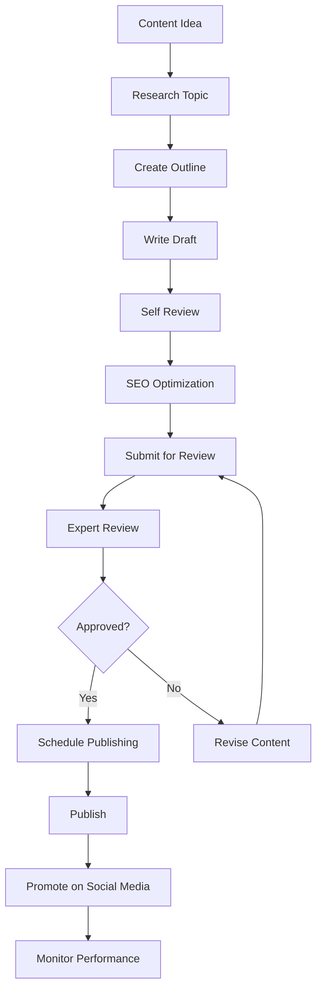
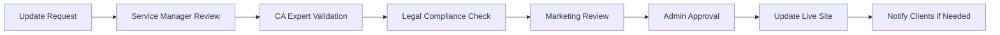

# Content Management Implementation Guide

## 🚀 Getting Started - First Week Setup

### Day 1: System Setup
```bash
# Content Management Setup Checklist
□ Set up admin panel access for content team
□ Create user roles (Author, Editor, Admin)
□ Configure content approval workflow
□ Set up content calendar system
□ Install SEO tools and analytics
□ Create content backup system
```

### Day 2: Team Training
```bash
# Training Checklist
□ Train content team on admin panel
□ Explain content approval workflow
□ Share writing guidelines and templates
□ Set up content calendar access
□ Assign content responsibilities
□ Schedule regular content meetings
```

### Day 3: Content Audit
```bash
# Current Content Audit
□ Review all existing blog posts
□ Audit service page descriptions
□ Check team member profiles
□ Review knowledge hub resources
□ Identify content gaps
□ Create content improvement plan
```

### Day 4: Content Planning
```bash
# Content Strategy Setup
□ Create 3-month content calendar
□ Plan blog post topics
□ Schedule service updates
□ Plan knowledge hub additions
□ Set content goals and KPIs
□ Create content promotion strategy
```

### Day 5: Implementation
```bash
# Start Content Creation
□ Create first blog post using template
□ Update one service page
□ Add new team member profile
□ Create first knowledge hub resource
□ Test approval workflow
□ Monitor analytics setup
```

## 📝 Weekly Content Management Routine

### Monday Morning (30 minutes) - Planning
```typescript
interface MondayTasks {
  analytics: {
    action: 'Review last week performance';
    tools: ['Google Analytics', 'Search Console'];
    metrics: ['Traffic', 'Engagement', 'Conversions'];
  };
  planning: {
    action: 'Plan this week content';
    deliverables: ['Blog post topics', 'Social media posts', 'Service updates'];
  };
  calendar: {
    action: 'Update content calendar';
    schedule: ['Publishing dates', 'Review deadlines', 'Promotion timeline'];
  };
}
```

### Tuesday (2-3 hours) - Blog Content
```bash
# Tuesday Blog Tasks
□ Write new blog post (1.5 hours)
□ Optimize previous posts for SEO (30 minutes)
□ Respond to blog comments (15 minutes)
□ Schedule social media promotion (15 minutes)
□ Update blog categories if needed (15 minutes)
```

### Wednesday (1-2 hours) - Services & Knowledge Hub
```bash
# Wednesday Service Tasks
□ Review service descriptions (30 minutes)
□ Update pricing if needed (15 minutes)
□ Add new calculator or tool (45 minutes)
□ Update FAQ section (15 minutes)
□ Check service inquiry responses (15 minutes)
```

### Thursday (1 hour) - Team & Company Info
```bash
# Thursday Team Tasks
□ Update team member achievements (20 minutes)
□ Review company information (15 minutes)
□ Update contact details (10 minutes)
□ Check testimonials section (15 minutes)
```

### Friday (1 hour) - Analytics & Optimization
```bash
# Friday Optimization Tasks
□ Analyze week's performance (30 minutes)
□ Fix any broken links (15 minutes)
□ Update meta descriptions (15 minutes)
□ Plan next week's content (15 minutes)
□ Generate weekly report (15 minutes)
```

## 🎯 Content Creation Workflows

### Blog Post Creation Workflow


### Service Update Workflow


## 📊 Performance Monitoring System

### Daily Monitoring (10 minutes)
```typescript
interface DailyMetrics {
  website: {
    visitors: number;
    pageViews: number;
    bounceRate: number;
    averageSessionDuration: number;
  };
  content: {
    newComments: number;
    socialShares: number;
    contactFormSubmissions: number;
  };
  technical: {
    siteSpeed: number;
    uptime: number;
    errors: string[];
  };
}
```

### Weekly Analysis (30 minutes)
```bash
# Weekly Analytics Review
□ Top performing blog posts
□ Most visited service pages
□ Popular knowledge hub resources
□ Social media engagement
□ Lead generation metrics
□ SEO ranking changes
```

### Monthly Deep Dive (2 hours)
```bash
# Monthly Performance Analysis
□ Content performance trends
□ User behavior analysis
□ Conversion funnel analysis
□ SEO progress report
□ Competitor content analysis
□ Content gap identification
```

## 🔧 Technical Implementation

### Content Management System Setup
```typescript
interface CMSConfiguration {
  userRoles: {
    author: ['create_posts', 'edit_own_posts'];
    editor: ['create_posts', 'edit_all_posts', 'publish_posts'];
    admin: ['all_permissions'];
  };
  workflow: {
    draft: 'Author creates content';
    review: 'Editor reviews content';
    approved: 'Admin approves for publishing';
    published: 'Content goes live';
  };
  automation: {
    seoCheck: 'Automatic SEO score calculation';
    imageOptimization: 'Automatic image compression';
    socialSharing: 'Auto-post to social media';
    analytics: 'Automatic performance tracking';
  };
}
```

### API Endpoints for Content Management
```typescript
// Blog Management APIs
const blogAPI = {
  create: 'POST /api/admin/blog/posts',
  update: 'PUT /api/admin/blog/posts/:id',
  publish: 'PATCH /api/admin/blog/posts/:id/publish',
  schedule: 'PATCH /api/admin/blog/posts/:id/schedule',
  list: 'GET /api/admin/blog/posts',
  analytics: 'GET /api/admin/blog/posts/:id/analytics'
};

// Service Management APIs
const serviceAPI = {
  create: 'POST /api/admin/services',
  update: 'PUT /api/admin/services/:id',
  toggle: 'PATCH /api/admin/services/:id/toggle-status',
  pricing: 'PATCH /api/admin/services/:id/pricing',
  list: 'GET /api/admin/services',
  analytics: 'GET /api/admin/services/:id/analytics'
};

// Team Management APIs
const teamAPI = {
  create: 'POST /api/admin/team/members',
  update: 'PUT /api/admin/team/members/:id',
  activate: 'PATCH /api/admin/team/members/:id/activate',
  list: 'GET /api/admin/team/members'
};
```

## 📋 Quality Assurance Checklist

### Content Quality Standards
```bash
# Before Publishing Any Content
□ Grammar and spelling checked
□ Facts verified by CA expert
□ Legal compliance reviewed
□ SEO optimized (title, description, keywords)
□ Images optimized and have alt text
□ Internal links added where relevant
□ Call-to-action included
□ Mobile-friendly formatting
□ Loading speed tested
□ Social media preview checked
```

### SEO Checklist
```bash
# SEO Optimization Checklist
□ Primary keyword in title and first paragraph
□ Meta description 150-160 characters
□ URL slug optimized
□ Header tags (H1, H2, H3) used properly
□ Image alt text includes keywords
□ Internal links to relevant pages
□ External links to authoritative sources
□ Schema markup added where applicable
□ Page loading speed < 3 seconds
□ Mobile responsiveness verified
```

## 🎯 Content Goals & KPIs

### Monthly Content Goals
```typescript
interface ContentGoals {
  blog: {
    postsPublished: 8; // 2 per week
    averageViews: 500; // per post
    socialShares: 50; // per post
    leadGeneration: 20; // inquiries from blog
  };
  services: {
    pageViews: 2000; // total service pages
    inquiries: 50; // service inquiries
    conversionRate: 2.5; // percentage
  };
  knowledgeHub: {
    resourceDownloads: 100;
    calculatorUsage: 200;
    userEngagement: 5; // minutes average
  };
  overall: {
    organicTraffic: 5000; // monthly visitors
    leadGeneration: 100; // total inquiries
    brandAwareness: 10; // percentage increase
  };
}
```

### Success Metrics
```bash
# Key Performance Indicators
□ Website traffic growth: +20% month-over-month
□ Blog engagement: 3+ minutes average time on page
□ Service inquiries: 50+ per month
□ Social media growth: +15% followers monthly
□ SEO rankings: Top 10 for 20+ keywords
□ Lead conversion: 5% inquiry to client conversion
□ Content shares: 100+ social shares monthly
```

## 🔄 Continuous Improvement Process

### Monthly Content Review
```bash
# Monthly Review Process
□ Analyze top performing content
□ Identify underperforming content
□ Review user feedback and comments
□ Update content based on new regulations
□ Refresh outdated information
□ Plan content improvements
□ Update content strategy if needed
```

### Quarterly Strategy Review
```bash
# Quarterly Strategic Review
□ Review overall content performance
□ Analyze competitor content strategies
□ Update content calendar for next quarter
□ Revise content goals and KPIs
□ Plan new content initiatives
□ Update team training if needed
□ Implement new tools or processes
```

## 📞 Emergency Content Procedures

### Urgent Regulatory Updates
```bash
# Emergency Content Protocol
1. Receive urgent regulatory update
2. Assign to CA expert for immediate review
3. Create urgent blog post within 2 hours
4. Fast-track approval process
5. Publish with "URGENT UPDATE" tag
6. Send email newsletter to all subscribers
7. Post on all social media channels
8. Update relevant service pages
9. Monitor client inquiries and respond
```

### Crisis Communication
```bash
# Crisis Communication Steps
1. Assess situation and impact
2. Prepare factual response
3. Get legal and CA expert approval
4. Publish official statement on website
5. Update all relevant content
6. Monitor social media mentions
7. Respond to client inquiries promptly
8. Follow up with additional information as needed
```

This implementation guide provides a complete framework for managing all content on your CA Professional Website efficiently and effectively.
