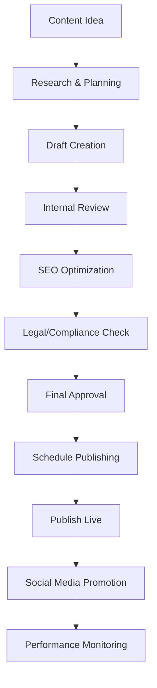
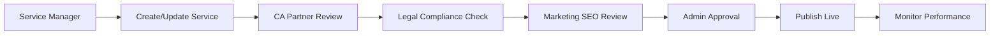

# CA Professional Website - Content Management System

## 🎯 Complete Content Management Flow

### Overview
This document provides a comprehensive, actionable content management system for the CA Professional Website, including step-by-step procedures for updating blogs, services, team information, and all dynamic content.

## 📋 Content Management Dashboard

### Content Types & Responsibilities
```typescript
interface ContentManagement {
  blogs: {
    owner: 'Marketing Team' | 'CA Experts';
    frequency: 'Weekly (2-3 posts)';
    approval: 'Multi-stage workflow';
  };
  services: {
    owner: 'Service Managers' | 'CA Partners';
    frequency: 'Monthly review';
    approval: 'Technical + Legal review';
  };
  team: {
    owner: 'HR Department' | 'Individual CAs';
    frequency: 'Quarterly update';
    approval: 'Admin approval';
  };
  knowledge: {
    owner: 'Content Team' | 'Subject Experts';
    frequency: 'Bi-weekly';
    approval: 'Expert review';
  };
}
```

## 📝 Blog Management System

### Step 1: Blog Creation Workflow


### Step 2: Blog Content Structure
```typescript
interface BlogPost {
  // Basic Information
  title: string;
  slug: string;
  excerpt: string;
  content: string; // Rich text/Markdown
  
  // Author Information
  author: {
    id: string;
    name: string;
    designation: string;
    profileImage: string;
    bio: string;
  };
  
  // Categorization
  category: 'tax_updates' | 'business_tips' | 'compliance' | 'audit' | 'gst' | 'advisory';
  tags: string[];
  
  // SEO & Marketing
  seoTitle: string;
  seoDescription: string;
  featuredImage: string;
  socialMediaImage: string;
  
  // Publishing
  status: 'draft' | 'review' | 'approved' | 'scheduled' | 'published' | 'archived';
  publishedAt: Date;
  scheduledFor?: Date;
  
  // Analytics
  readingTime: number; // Auto-calculated
  views: number;
  likes: number;
  shares: number;
  comments: Comment[];
  
  // Workflow
  createdBy: string;
  reviewedBy?: string;
  approvedBy?: string;
  lastModified: Date;
}
```

### Step 3: Blog Creation Process

#### 3.1 Content Planning
1. **Monthly Content Calendar**
   - Plan 8-12 blog posts per month
   - Mix of evergreen and timely content
   - Balance between different categories
   - Align with business objectives

2. **Content Ideas Sources**
   - Client frequently asked questions
   - Recent regulatory changes
   - Industry trends and news
   - Seasonal tax deadlines
   - Case studies and success stories

#### 3.2 Writing Guidelines
```markdown
# Blog Writing Standards

## Title Guidelines
- 50-60 characters for SEO
- Include primary keyword
- Make it compelling and clickable
- Use numbers when possible

## Content Structure
1. **Introduction** (100-150 words)
   - Hook the reader
   - State the problem/topic
   - Preview what they'll learn

2. **Main Content** (800-1500 words)
   - Use H2 and H3 headings
   - Include bullet points and lists
   - Add relevant examples
   - Include actionable advice

3. **Conclusion** (100-150 words)
   - Summarize key points
   - Include call-to-action
   - Encourage engagement

## SEO Requirements
- Primary keyword in title and first paragraph
- Use keywords naturally throughout
- Include internal links to services
- Add external links to authoritative sources
- Optimize meta description (150-160 characters)
```

### Step 4: Blog Update API Endpoints
```typescript
// Create new blog post
POST /api/admin/blog/posts
{
  "title": "Understanding GST Compliance in 2024",
  "content": "...",
  "category": "tax_updates",
  "tags": ["GST", "compliance", "2024"],
  "featuredImage": "url_to_image",
  "status": "draft",
  "authorId": "ca-expert-id"
}

// Update existing blog post
PUT /api/admin/blog/posts/:id
{
  "title": "Updated title",
  "content": "Updated content...",
  "status": "review"
}

// Submit for review
PATCH /api/admin/blog/posts/:id/submit-review
{
  "reviewNotes": "Ready for technical review"
}

// Approve blog post
PATCH /api/admin/blog/posts/:id/approve
{
  "approvalNotes": "Approved for publishing",
  "scheduledFor": "2024-01-15T10:00:00Z"
}

// Publish blog post
PATCH /api/admin/blog/posts/:id/publish
{
  "publishedAt": "2024-01-15T10:00:00Z"
}

// Get all blog posts (admin)
GET /api/admin/blog/posts?status=draft&page=1&limit=10

// Get published blog posts (public)
GET /api/blog/posts?category=tax_updates&page=1&limit=10
```

## 🛠️ Service Management System

### Step 1: Service Information Structure
```typescript
interface Service {
  // Basic Information
  name: string;
  slug: string;
  description: string;
  detailedDescription: string;
  
  // Categorization
  category: 'tax_planning' | 'audit' | 'advisory' | 'gst' | 'registration' | 'compliance';
  subcategory: string;
  
  // Pricing Information
  pricing: {
    type: 'fixed' | 'hourly' | 'range' | 'custom';
    basePrice?: number;
    minPrice?: number;
    maxPrice?: number;
    hourlyRate?: number;
    currency: 'INR';
  };
  
  // Service Details
  requirements: string[];
  deliverables: string[];
  processSteps: ProcessStep[];
  duration: string;
  complexity: 'simple' | 'medium' | 'complex' | 'expert';
  
  // Status & Visibility
  isActive: boolean;
  isFeatured: boolean;
  isPopular: boolean;
  
  // SEO & Marketing
  seoTitle: string;
  seoDescription: string;
  featuredImage: string;
  galleryImages: string[];
  
  // Analytics
  inquiries: number;
  conversions: number;
  averageRating: number;
  
  // Workflow
  createdBy: string;
  lastUpdatedBy: string;
  lastReviewDate: Date;
}
```

### Step 2: Service Update Process


### Step 3: Service Management Procedures

#### 3.1 Adding New Service
1. **Service Manager** logs into admin panel
2. Navigate to Services → Add New Service
3. Fill in all required information:
   - Service name and description
   - Category and subcategory
   - Pricing structure
   - Requirements and deliverables
   - Process steps
4. Upload featured image and gallery images
5. Set SEO title and description
6. Submit for review

#### 3.2 Updating Existing Service
1. Navigate to Services → Manage Services
2. Find service to update
3. Click Edit
4. Make necessary changes
5. Add update notes
6. Submit for review if major changes

#### 3.3 Service Review Process
1. **CA Partner** reviews technical accuracy
2. **Legal Team** checks compliance requirements
3. **Marketing Team** optimizes SEO content
4. **Admin** gives final approval
5. Service goes live automatically

### Step 4: Service API Endpoints
```typescript
// Create new service
POST /api/admin/services
{
  "name": "Tax Planning & Advisory",
  "category": "tax_planning",
  "pricing": {
    "type": "range",
    "minPrice": 15000,
    "maxPrice": 50000
  },
  "requirements": ["PAN Card", "Previous ITR"],
  "deliverables": ["Tax Planning Report"]
}

// Update service
PUT /api/admin/services/:id

// Toggle service status
PATCH /api/admin/services/:id/toggle-status

// Submit for review
PATCH /api/admin/services/:id/submit-review

// Get all services (admin)
GET /api/admin/services

// Get active services (public)
GET /api/services?category=tax_planning
```

## 👥 Team Management System

### Step 1: Team Member Profile Structure
```typescript
interface TeamMember {
  // Personal Information
  personalInfo: {
    firstName: string;
    lastName: string;
    designation: string;
    department: string;
    profileImage: string;
    bio: string;
    joinDate: Date;
  };
  
  // Professional Information
  professional: {
    membershipNumber: string;
    membershipType: 'Associate' | 'Fellow';
    qualifications: string[];
    specializations: string[];
    experienceYears: number;
    achievements: string[];
    certifications: Certification[];
  };
  
  // Contact Information
  contact: {
    email: string;
    phone: string;
    linkedIn?: string;
    twitter?: string;
  };
  
  // Display Settings
  isActive: boolean;
  isPublicProfile: boolean;
  displayOrder: number;
  showOnAboutPage: boolean;
  
  // Analytics
  profileViews: number;
  clientInquiries: number;
}
```

### Step 2: Team Update Process
1. **HR Department** maintains basic information
2. **Individual CAs** update their profiles through self-service portal
3. **Admin** approves changes
4. **Marketing** optimizes for website display

### Step 3: Team Management Procedures

#### 3.1 Adding New Team Member
1. HR creates new team member profile
2. Send login credentials to team member
3. Team member completes profile information
4. Admin reviews and approves
5. Profile goes live on website

#### 3.2 Updating Team Member Information
1. Team member logs into profile portal
2. Updates professional information
3. Uploads new profile photo if needed
4. Submits for approval
5. Admin reviews and approves changes

## 📚 Knowledge Hub Management

### Step 1: Resource Types
- **Articles** - In-depth guides and tutorials
- **Calculators** - Interactive financial tools
- **Templates** - Downloadable forms and documents
- **Webinars** - Recorded and live sessions
- **Case Studies** - Real-world examples
- **Regulatory Updates** - Latest compliance news

### Step 2: Resource Management API
```typescript
// Create knowledge resource
POST /api/admin/knowledge/resources
{
  "title": "Income Tax Calculator 2024",
  "type": "calculator",
  "category": "tax_tools",
  "description": "Calculate your income tax liability",
  "content": "...",
  "downloadUrl": "url_to_calculator",
  "isPublic": true
}

// Update resource
PUT /api/admin/knowledge/resources/:id

// Get resources by type
GET /api/knowledge/resources?type=calculator&category=tax_tools
```
