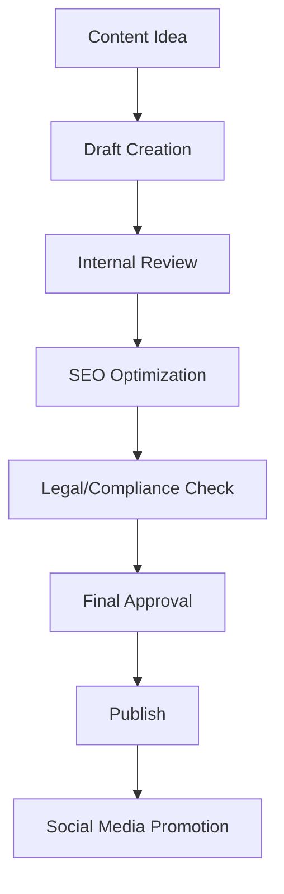

# Content Management & Update Flow Guide

## Overview
This document provides a comprehensive guide on how to manage and update all content in the CA Professional Website, including blogs, services, team information, and other dynamic content.

## 🎯 Content Management Strategy

### Content Types & Ownership
1. **Blog Posts** - Marketing team, CA experts
2. **Service Information** - Service managers, CA partners
3. **Team Profiles** - HR department, individual CAs
4. **Knowledge Hub Resources** - Content team, subject matter experts
5. **Company Information** - Management, admin team
6. **Client Testimonials** - Client relations team
7. **News & Updates** - Marketing team

## 📝 Blog Management Workflow

### 1. Blog Creation Process


### 2. Blog Content Structure
```typescript
interface BlogPost {
  title: string;
  slug: string;
  excerpt: string;
  content: string; // Rich text/Markdown
  author: {
    id: string;
    name: string;
    designation: string;
    profileImage: string;
  };
  category: BlogCategory;
  tags: string[];
  featuredImage: string;
  seoTitle: string;
  seoDescription: string;
  publishedAt: Date;
  status: 'draft' | 'review' | 'published' | 'archived';
  readingTime: number; // Auto-calculated
  views: number;
  likes: number;
}
```

### 3. Blog Update API Endpoints
```typescript
// Create new blog post
POST /api/admin/blog/posts
{
  "title": "Understanding GST Compliance in 2024",
  "content": "...",
  "category": "tax_updates",
  "tags": ["GST", "compliance", "2024"],
  "featuredImage": "url_to_image",
  "status": "draft"
}

// Update existing blog post
PUT /api/admin/blog/posts/:id
{
  "title": "Updated title",
  "content": "Updated content..."
}

// Publish blog post
PATCH /api/admin/blog/posts/:id/publish
{
  "publishedAt": "2024-01-15T10:00:00Z"
}

// Get all blog posts (admin)
GET /api/admin/blog/posts?status=draft&page=1&limit=10

// Get published blog posts (public)
GET /api/blog/posts?category=tax_updates&page=1&limit=10
```

## 🛠️ Service Management Workflow

### 1. Service Information Updates
```typescript
interface Service {
  name: string;
  slug: string;
  description: string;
  detailedDescription: string;
  category: ServiceCategory;
  pricing: {
    type: 'fixed' | 'hourly' | 'range' | 'custom';
    basePrice?: number;
    minPrice?: number;
    maxPrice?: number;
    hourlyRate?: number;
  };
  requirements: string[];
  deliverables: string[];
  processSteps: ProcessStep[];
  duration: string;
  complexity: 'simple' | 'medium' | 'complex' | 'expert';
  isActive: boolean;
  isFeatured: boolean;
  seoTitle: string;
  seoDescription: string;
  featuredImage: string;
  galleryImages: string[];
}
```

### 2. Service Update Process
1. **Service Manager** creates/updates service information
2. **CA Partner** reviews technical accuracy
3. **Legal Team** reviews compliance requirements
4. **Marketing Team** optimizes SEO content
5. **Admin** approves and publishes

### 3. Service API Endpoints
```typescript
// Create new service
POST /api/admin/services
{
  "name": "Tax Planning & Advisory",
  "category": "tax_planning",
  "pricing": {
    "type": "range",
    "minPrice": 15000,
    "maxPrice": 50000
  },
  "requirements": ["PAN Card", "Previous ITR"],
  "deliverables": ["Tax Planning Report"]
}

// Update service
PUT /api/admin/services/:id

// Toggle service status
PATCH /api/admin/services/:id/toggle-status

// Get all services (admin)
GET /api/admin/services

// Get active services (public)
GET /api/services?category=tax_planning
```

## 👥 Team Management Workflow

### 1. Team Member Profile Structure
```typescript
interface TeamMember {
  personalInfo: {
    firstName: string;
    lastName: string;
    designation: string;
    department: string;
    profileImage: string;
    bio: string;
  };
  professional: {
    membershipNumber: string;
    qualifications: string[];
    specializations: string[];
    experienceYears: number;
    achievements: string[];
  };
  contact: {
    email: string;
    phone: string;
    linkedIn?: string;
  };
  isActive: boolean;
  displayOrder: number;
}
```

### 2. Team Update Process
1. **HR Department** maintains basic information
2. **Individual CAs** update their profiles
3. **Admin** approves changes
4. **Marketing** optimizes for website display

## 📚 Knowledge Hub Content Management

### 1. Resource Types
- **Articles** - In-depth guides and tutorials
- **Calculators** - Interactive financial tools
- **Templates** - Downloadable forms and documents
- **Webinars** - Recorded and live sessions
- **Case Studies** - Real-world examples
- **Regulatory Updates** - Latest compliance news

### 2. Resource Management API
```typescript
// Create knowledge resource
POST /api/admin/knowledge/resources
{
  "title": "Income Tax Calculator 2024",
  "type": "calculator",
  "category": "tax_tools",
  "description": "Calculate your income tax liability",
  "content": "...",
  "downloadUrl": "url_to_calculator",
  "isPublic": true
}

// Update resource
PUT /api/admin/knowledge/resources/:id

// Get resources by type
GET /api/knowledge/resources?type=calculator&category=tax_tools
```

## 🔄 Content Update Workflows

### Daily Content Tasks
- [ ] Review and respond to blog comments
- [ ] Check for new regulatory updates
- [ ] Monitor website analytics
- [ ] Update social media content
- [ ] Review client testimonials

### Weekly Content Tasks
- [ ] Publish new blog posts (2-3 per week)
- [ ] Update service pricing if needed
- [ ] Review and update FAQ section
- [ ] Check for broken links
- [ ] Update team achievements/certifications

### Monthly Content Tasks
- [ ] Comprehensive SEO audit
- [ ] Update all service descriptions
- [ ] Review and update company information
- [ ] Analyze content performance
- [ ] Plan next month's content calendar

### Quarterly Content Tasks
- [ ] Major website content review
- [ ] Update all legal/compliance information
- [ ] Refresh team photos and bios
- [ ] Update service portfolio
- [ ] Review and update pricing strategy

## 🚀 Content Publishing Pipeline

### 1. Content Creation Tools
- **CMS**: Custom admin panel or headless CMS
- **Writing**: Google Docs with collaboration
- **Design**: Canva/Figma for graphics
- **SEO**: SEMrush/Ahrefs for optimization
- **Analytics**: Google Analytics for performance

### 2. Content Approval Workflow


### 3. Content Quality Checklist
- [ ] Grammar and spell check completed
- [ ] SEO title and description optimized
- [ ] Images optimized and alt text added
- [ ] Internal links added where relevant
- [ ] Call-to-action included
- [ ] Mobile responsiveness verified
- [ ] Loading speed tested
- [ ] Legal compliance verified

## 📊 Content Performance Monitoring

### Key Metrics to Track
1. **Blog Performance**
   - Page views and unique visitors
   - Time on page and bounce rate
   - Social shares and comments
   - Lead generation from content

2. **Service Pages**
   - Conversion rates
   - Inquiry form submissions
   - Time spent on service pages
   - Exit rates

3. **Knowledge Hub**
   - Resource downloads
   - Calculator usage
   - User engagement
   - Return visitors

### Monthly Reporting
- Content performance dashboard
- Top performing articles
- Service inquiry trends
- User behavior analysis
- SEO ranking improvements

## 🔧 Technical Implementation

### Content Management System Features
1. **Rich Text Editor** with markdown support
2. **Media Library** for image/document management
3. **SEO Tools** built into content editor
4. **Preview Mode** before publishing
5. **Version Control** for content changes
6. **Scheduled Publishing** for content calendar
7. **User Roles** for content approval workflow
8. **Analytics Integration** for performance tracking

### API Integration Points
- Blog management endpoints
- Service catalog management
- Team profile management
- Knowledge hub resources
- Media file management
- SEO metadata management
- Analytics data collection

This content management flow ensures consistent, high-quality content across the entire CA Professional Website while maintaining proper approval workflows and performance monitoring.
